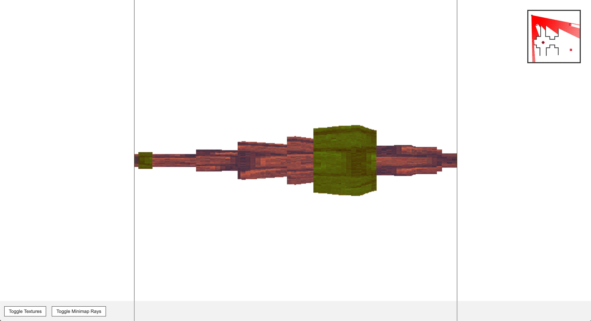

# Simple Ray Caster

To test out:
  1. `npm install && npm start`
  2. and navigate to the URL provided by Parcel.js (defaults to http://localhost:1234)

Controls:

 - `w`: Move Forward
 - `a`: Rotate Counter-Clockwise
 - `s`: Move Backward
 - `d`: Rotate Clockwise

You can toggle textures and minimap rays in the UI.

### Screenshot:
